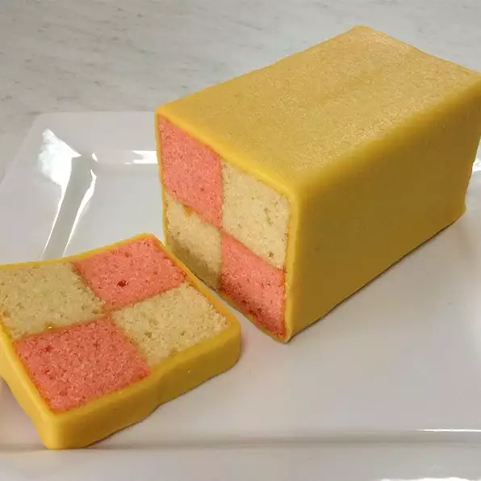

# Recipes
### The Odin Project -> Foundations -> HTML Foundations -> Project: Recipes
---
A basic project to put some HTML knowledge into practice, no much to say, an easy but essential project :)
---
## Credits:
**I used these images, you can find them in the folder ``` img ``` folder:**

[](https://www.pexels.com/photo/set-of-tasty-fresh-vegetables-and-herbs-with-empty-clipboard-4033639/)

*Image by [Karolina Grabowska](https://www.pexels.com/@karolina-grabowska/) from [Pexels](https://pexels.com)*

---




*Images taken from [allrecipes](https://www.allrecipes.com/)*
